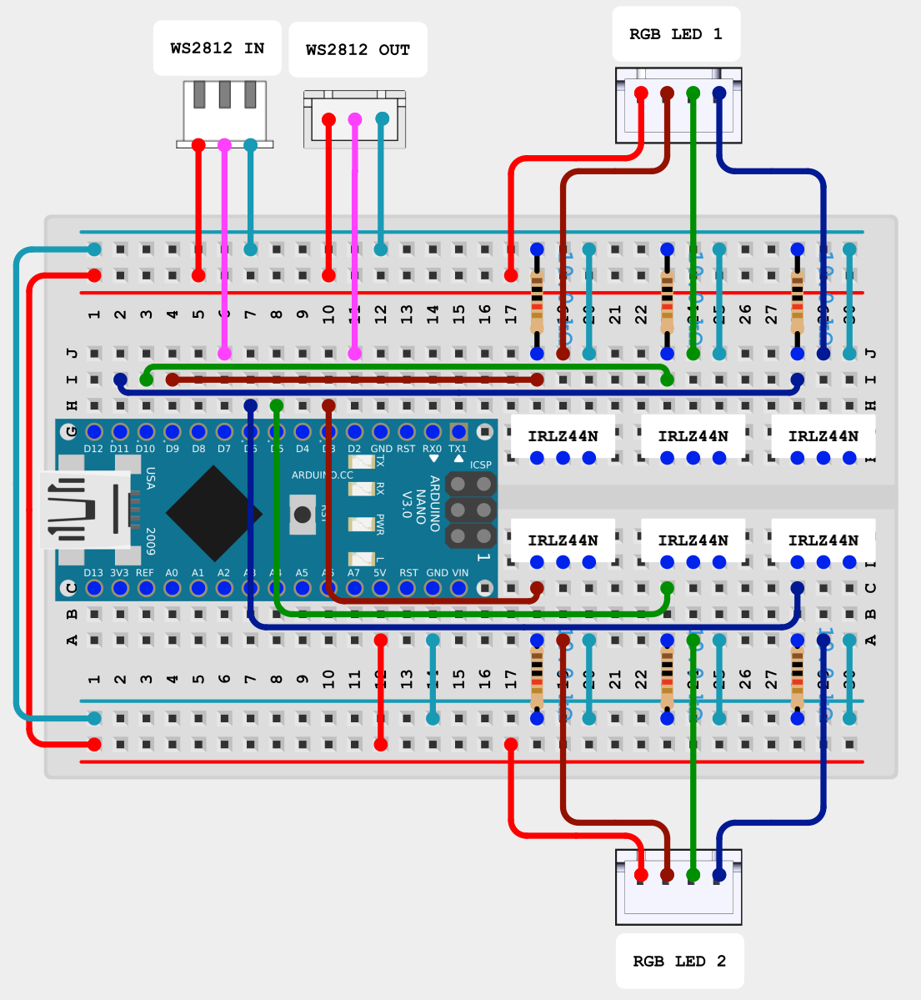

# rgb2aled

## What it does
This project allows you to connect 1 or 2 RGB LEDs to an addressable LED (WS2812) controller, and provides a standard WS2812 passthrough so that you can daisy-chain additional LEDs - or even daisy chain these controllers together. The LEDs must be 5V, common-anode.

Note that in its current form this cannot support 12V RGB LEDs nor common-cathode LEDs, though it shouldn't be super difficult to make variations to the design for those.

This device can be built for around $15 of materials, and the software is provided here free-of-charge.

## Why is it useful
I have been building a virtual pinball machine, following [Way of the Wrench](https://youtube.com/playlist?list=PLrqlHbqP7FINmGgJoszVvWOOyb8shdfUn&si=c6fxJmt26F5moLLm)'s build guide, but I am not using exactly the same parts. I have a [fire button lockdown bar](https://virtuapin.net/index.php?main_page=product_info&cPath=3&products_id=258&zenid=7tpvet5sqb5fvuqoi35te1doc5) from [Virtuapin.net](virtuapin.net), and I have 4 [RGB leaf buttons](https://www.clevelandsoftwaredesign.com/pinball-parts/p/rgb-true-leaf-button) from [Cleveland Software Design](clevelandsoftwaredesign.com). I was having trouble trying to connect them to my cabinet and control them with DOF since I don't have a 5V RGB LED controller. I foolishly tried connecting one to a 12V RGB controller and the "magic smoke" was released! (don't do that!) Emil's videos sparked the idea to adapt these LEDs to support the WS2812 addressable-LED standard, that way I can connect them to my Wemos lighting controller.

There are probably other use cases for hooking "regular" LEDs up to addressable-LED light strips. If you have another use case let me know!

## Hardware
To support 1 RGB LED, you'll need:
- 1x [Arduino Nano v3](https://a.co/d/9rjba7l). Any ATMega328P clone should work as long as it is running at 16MHz.
- 3x [resistors](https://a.co/d/9rjba7l) - anything from 1kΩ to 100kΩ should work fine. I used a mix of 10kΩ and 5.1kΩ resistors that I had lying around.
- 3x N-type MOSFETs. I used [IRLZ44Ns](https://a.co/d/9rjba7l).
- [Male and female JST 3-pin connectors](https://a.co/d/ethh2G7) to connect to a standard WS2812 daisy chain.
- 1x [RGB LED connector](https://a.co/d/aOVf79y).
- Something to mount it on. I used a [1/2 size breadboard from ElectroCookie](https://a.co/d/e8n7Chf).

If you want to support 2 RGB LEDs from one board, add to this:
- 3x additional resistors
- 3x additional N-type MOSFETs
- 1x additional RGB LED connector.

Sorry - there's no way to drive more than 2 LEDs from one Arduino Nano, at least not with this design. The Arduino only has 6 PWM output channels and each LED uses 3 of them. To support my 5 total RGB LEDs I just built 3 of these devices and daisy-chained them.

The board hooks up to a standard addressable-LED strip or controller, acts as 1 or 2 additional "pixels" driving 1 or two connected "dumb" LEDs, and then passes through up any remaining data to additional controllers or light strips.

> [!WARNING]
> Although any number of LEDs can be daisy chained from data-out, make sure if you have more than about 15 or so, that you inject power to the strip immediately after this board in the sequence. Each LED can use up to 60mA power at full brightness. A breadboard is usually only rated for 1-2 amps at most. Usually light strips have both an input connector and separate power and ground inputs - hook those directly to your 5V power supply to avoid sending that much current through this controller.

The wiring diagram is shown [in the PDF](Schematic_RGB-to-ALED.pdf). This circuit will fit on a 1/2 size breadboard, though its tight: 

## Software
Next you need to program the Arduino to make it function. Download and open the free Arduino IDE and create a "sketch". Insert the code from the .ino file. If you have only one LED, comment out the line `#define TWO_LEDS`. This is important! The board will behave strangely if you don't set or unset TWO_LEDS correctly in the code, to match what you actually have connected to the device.

Compile and upload it to your Arduino. Note: I had to select "Tools > Processor > ATMega328P (Old Processor)" for my boards or the code would not upload; YMMV based on the exact hardware you have.

The 16MHz Arduino is just barely fast enough to handle the timing required by using hand-optimized assembly code with fully unrolled loops. As a result the code requires specific clock cycle timing and supports ONLY a 16MHz processor. There are 48MHz and faster Arduinos out there like the Nano r4 and the Nano 33, but those <u>will not work</u> with this software.

## Putting it all together
I created 3d-printable cases for these when they are built on the ElectroCookie 1/2-size breadboards; STLs are available in this repo. Use M2 x 4mm screws to connect the breadboard to the bottom of the case, then use M3 x 6mm screws to connect the top of the case to the bottom of the case. 
